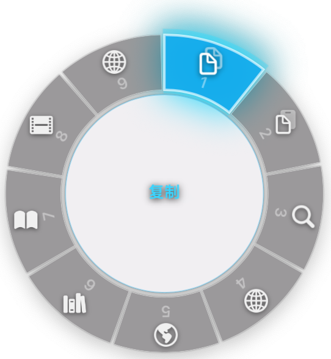

<div align="center">

# ActionHalo 🔥

**An ultra-smooth circular menu tool for macOS with both click-to-execute and press-drag-release execution after selection.**

[**English**](./README.md) • [简体中文](./README_zh.md)

[](https://apple.com/macos)
[](https://developer.apple.com/swift)
[](https://opensource.org/licenses/MIT)



> ActionHalo draws inspiration from both GTA V and PopClip, then massively refactors and optimizes the UI, interaction model, and performance with native Core Animation and Swift Concurrency.

</div>

---

## ✨ Features That Wow

🚀 **Esports-level Response Speed**
Bottom-layer hit testing based on `mouseDown` / `mouseDragged` / `mouseUp`. Bid farewell to missed clicks. In both workflows, the wheel is triggered only after you finish the text selection and release the mouse button. From there, ActionHalo supports two distinct execution styles:

- **Release, then click to execute**: select text, release to open the wheel, then click the action you want.
- **Release, press, drag, then release to execute**: select text, release to open the wheel, immediately press again, drag across to the target slice, then release to fire that action.

The hover state tracks your cursor with near-zero latency, so the second mode feels closer to a GTA V weapon wheel than a traditional context menu.

💫 **Native Blur & 60FPS Animations**
Uses `NSVisualEffectView` and `CAShapeLayer` buffer pool. Page flipping, hovering, and clicking animations are buttery smooth with no frame drops.

🎛️ **Highly Customizable UI**
Adjust the radial menu's **Ring Opacity** and **Max Items limit** (6, 8, 12, or 16 items per page) directly from the Menu Bar. You can also toggle **GTA Mode** for a heavier weapon-wheel style presentation with a darker HUD-like look.

🔌 **Hot-pluggable Plugin System**
Supports custom `.actionhaloext` plugin packages. Features double-click installation, background thread asynchronous loading, and a package management mechanism supporting deletion and disabling.

🧠 **Smart Trigger Context**
Rewritten Accessibility recognition logic at the foundation. Text-selection actions stay focused on the selected content itself, while input-related actions still respect whether the current focus is actually editable.

✂️ **Cleaner Quick Actions**
When ActionHalo detects that you clicked into an editable field and there is no active text selection, it can show a lightweight `Paste / Clear` capsule near the cursor for quick paste access or for clearing the current clipboard contents. When the clipboard is empty, this shortcut does not appear. The built-in `Paste` action can also appear in the radial menu for editable selections.

🚫 **Customizable App Blacklist**
Built-in automatic blacklist management UI. Supports dragging and dropping apps, or browsing via the `+` button to precisely block specific software.

---

## 🚀 Getting Started

### System Requirements

- **macOS 12 Monterey or later**. macOS 11 Big Sur and earlier are not supported.
- Both Apple silicon and Intel Macs are supported by the universal build.

### Installation

1. Download the latest `.dmg` from the [Releases](https://github.com/Wooden-Robot/ActionHalo/releases) page.
2. Open the downloaded file and drag the **ActionHalo** app into your `Applications` folder.
3. Launch ActionHalo. Community builds are ad-hoc signed rather than Apple-notarized, so on first launch macOS may block them. Open **System Settings → Privacy & Security** and choose **Open Anyway** for ActionHalo.
4. Open **System Settings → Privacy & Security → Accessibility** and grant permissions to ActionHalo (required for text selection detection).

### Updates

Use **Check for Updates...** from the menu bar. Choose **Install Update** when a signed update is offered; after the download is verified and ready, Sparkle asks for the standard **Install and Relaunch** confirmation, installs the app atomically, then relaunches the updated version. Automatic checks can still be enabled or disabled from the menu. If a plugin editor has unsaved changes, ActionHalo blocks the quit until you save them or explicitly discard them.

ActionHalo community builds do not use a Developer ID. Update authenticity comes from the Ed25519 public key embedded in the app, which verifies both the appcast and the downloaded archive before installation. Because ad-hoc signatures do not provide a stable Apple identity, macOS may ask you to grant Accessibility or Automation access again after an update.

### Upgrading from OpenFire

- OpenFire `v0.3.23`–`v0.3.26` can update to ActionHalo through Sparkle after the GitHub repository is renamed in place. The old repository URL must keep redirecting to `Wooden-Robot/ActionHalo`; do not delete/recreate the repository or reuse the old `OpenFire` slug.
- `v0.3.22` and earlier do not contain the trusted updater key, so they require one final manual ActionHalo DMG installation.
- ActionHalo keeps the existing bundle identifier during this transition, preserving preferences, launch-at-login state, permissions where macOS allows it, and the signed update chain. An upgraded copy may therefore remain physically named `OpenFire.app` while displaying and running as ActionHalo. Do not keep separate `OpenFire.app` and `ActionHalo.app` copies installed at the same time.
- Existing user plugins are copied once from `Application Support/OpenFire/Plugins` into the ActionHalo plugin directory without deleting the rollback copy. Legacy `.openfireext` packages, `com.openfire.*` plugin identifiers, and `OPENFIRE_TEXT` / `OPENFIRE_TEXT_FILE` remain accepted during the compatibility period.

### How Triggering Works

ActionHalo has **two ways to open the wheel**, and they are easy to confuse if described as one flow:

1. **Mouse selection trigger**: select text normally, then release the mouse button. The wheel appears only after the selection is complete and the button is up.
2. **Optional manual hotkey trigger**: if you set an `Open Menu Hotkey` in the menu bar, ActionHalo can open the wheel for the current selection without waiting for the mouse-release flow.

Once the wheel is already visible, there are **two ways to execute an action**:

1. **Release, then click**: let the wheel pop up, then click the slice you want.
2. **Release, press, drag, then release**: let the wheel pop up, press down again right away, drag into the target slice, then release to fire it.

The second execution style is the signature interaction: as soon as the wheel appears, you can go straight into a weapon-wheel-like press-drag-release motion instead of pausing to click a slice.

If you need to debug why the wheel did or did not appear, see the dedicated [Diagnostics Guide](./DIAGNOSTICS.md).

### Trigger Logic Summary

ActionHalo does not simply fire on every mouse drag. The current trigger pipeline is intentionally conservative:

1. A gesture must first look like an actual text-selection drag. Very short movements are treated as normal clicks instead of selection triggers.
2. ActionHalo suppresses obvious non-text scenarios before trying to acquire text:
   - file drags detected through the drag pasteboard
   - frontmost file-management or self contexts such as Finder, Dock, Desktop, and ActionHalo itself
   - known screenshot tools
   - window drags, detected by checking whether the frontmost window frame actually moved during the gesture
3. If the gesture survives those filters, ActionHalo tries native Accessibility selection first.
4. If Accessibility does not yield usable selected text quickly enough, ActionHalo falls back to a guarded `Cmd+C` path and waits briefly for a fresh clipboard update.
5. The wheel appears only after ActionHalo has real non-empty selected text from one of those paths.

In practice, this means:

- normal text selection in native editors should usually trigger through Accessibility
- browser and WebView selections may trigger through either Accessibility or the `Cmd+C` fallback, depending on what the host app exposes
- Telegram is allowed to rely more heavily on the `Cmd+C` fallback because its AX hit/focus state is often unreliable at mouse-up time
- dragging files or dragging windows should not trigger the wheel
- editable text inside otherwise blocked contexts, such as Finder rename fields, can still trigger normally

### What `Cmd+C` Fallback Actually Means

`Cmd+C` fallback is ActionHalo's backup acquisition path for apps that do not expose selected text reliably through the Accessibility API.

Instead of guessing the selected text, ActionHalo does the following:

1. Save the current pasteboard snapshot.
2. Wait very briefly so physical modifier keys from the user's gesture do not interfere with the synthetic copy event.
3. Post a synthetic `Cmd+C`.
4. Poll the system pasteboard for a short window and wait for a fresh non-empty text value to appear.
5. If a fresh copied value really arrived, use that text as the selection and restore the previous pasteboard snapshot.

This path exists mainly for apps such as:

- Telegram
- Electron-based apps
- browser or WebView hosts whose Accessibility selection state is incomplete or delayed

It is intentionally guarded and is **not** a blind "always copy on every drag" behavior. ActionHalo still checks context before allowing the fallback result to trigger the wheel. It also restores the previous clipboard only when the synthetic copy actually produced a fresh copied value, which helps avoid unnecessary clipboard churn.

So in short:

- `Accessibility API` is the preferred path
- `Cmd+C` fallback is the compatibility path
- both still require ActionHalo to conclude that the gesture looked like text selection rather than a file drag, window drag, or other non-text interaction

### Menu Bar Controls

ActionHalo lives in the macOS menu bar and exposes the main controls there:

- **Ring Opacity**: `0% (Opaque)` to `100% (Transparent)`
- **GTA Mode**: swaps the wheel into a heavier GTA V-style HUD presentation
- **Max Items in Menu**: `6 / 8 / 12 / 16`
- **Open Menu Hotkey**: manually open the wheel for the current selection. Default: `Shift + Option + D`
- **Auto Trigger Toggle Hotkey**: turn automatic text-selection triggering on or off. Default: `Shift + Option + X`
- **Plugin Management** and **App Blacklist**

Note: when **GTA Mode** is enabled, the wheel is intentionally rendered fully opaque and the opacity menu is disabled.

---

## 🧩 The Plugin Ecosystem

ActionHalo's true power lies in its plugin system. Plugins exist as `.actionhaloext` packages containing a simple `Config.json`.

### Pre-installed Plugins
| 🔌 Plugin | 📝 Description |
| :--- | :--- |
| **Copy / Cut / Delete** | Core editing actions for the selected text itself. |
| **Search / Translate / Dict** | Everyday text actions for web search, translation, and the macOS Dictionary app. |
| **Open Link / Reveal in Finder** | Context-aware built-ins for URLs and file paths. They stay visible and become executable only when the current selection matches. |

These core defaults are part of ActionHalo itself. They can be enabled, disabled, and reordered, but they cannot be edited or deleted; disable any core action you do not want to use. Bundled community plugins and plugins you create or install can be edited from Plugin Management.
Enabled plugins keep their slot in the wheel. If the current selection does not match a plugin's context, the action stays visible but disabled instead of disappearing before pagination.
The built-in `Paste` action can appear in the text-selection wheel when the current focus is editable, and it is also reused by the empty-input `Paste / Clear` popup.

### Community Plugins
Built into the package, they can be enabled, edited, or removed at any time via the "Plugin Management" interface:
- 🔍 [Baidu Search](./Plugins/BaiduSearch.actionhaloext/Config.json) / [Google Search](./Plugins/GoogleSearch.actionhaloext/Config.json): search the selected text on the web.
- 🧑‍💻 [GitHub Search](./Plugins/GitHubSearch.actionhaloext/Config.json): search the selected text on GitHub.
- 📚 [NeoDB Book Search](./Plugins/NeoDBBook.actionhaloext/Config.json) / [Douban Book Search](./Plugins/DoubanBook.actionhaloext/Config.json): look up books directly from the current selection.
- 🎬 [Douban Movie Search](./Plugins/DoubanMovie.actionhaloext/Config.json): search selected movie titles on Douban.
- ✈️ [Search in Telegram](./Plugins/Search%20Telegram.actionhaloext/Config.json): send the selected text into Telegram search.
- 📂 [Reveal in Finder](./Plugins/RevealPath.actionhaloext/Config.json): when the selection is a file path, open its location in Finder.
- 🖥️ [Run Shell](./Plugins/Run%20Shell.actionhaloext/Config.json): a default-disabled script plugin that runs a bundled shell script with the selected text.
- 💻 [Run in iTerm2](./Plugins/Run%20in%20iTerm2.actionhaloext/Config.json): a default-disabled plugin that sends the selected text to iTerm2 as a shell command.

---

## 🛠️ Build Your Own Plugin

ActionHalo comes with a fully-featured **Visual Plugin Editor** built right into the app. You no longer need to write JSON configurations manually!

1. Click the 🔥 ActionHalo icon in the macOS Menu Bar.
2. Select **Plugin Management...**
3. Click the `+` button at the bottom to open the Plugin Editor.
4. Fill in the details and choose an action type.

### Supported Action Types (Action `type`)
- 🌐 `url`: Open the system browser to visit `{text}`
- 🐚 `shell-script`: Run a bundled shell script with the selected text injected via environment variables
- 🍎 `applescript`: Run a bundled AppleScript with the selected text passed in by ActionHalo
- ⌨️ `key-combo`: Record system combo shortcuts directly from the UI
- 📋 `copy`: Copy to clipboard
- 📝 `paste`: Paste into the current input area
- 📂 `reveal-path`: Open the selected file path in Finder

#### Safe Regex Filters
Plugin `filter.regex` values run through a linear-time, non-backtracking matcher so an imported plugin cannot freeze the menu with pathological input. The supported subset includes literals, `.`, `^` / `$`, groups and `(?:...)`, alternation, character classes, `*` / `+` / `?` / `{m,n}`, and the `\s`, `\d`, and `\w` families. Lookarounds, backreferences, mode modifiers, lazy quantifiers, and possessive quantifiers are rejected. Patterns are limited to 1 KiB and regex-filtered selections to 4,096 UTF-16 code units; omit `filter.regex` when every selection should match.

#### Script Extensions
For `shell-script` and `applescript`, the standard plugin layout is to point `action.script` at a bundled script file inside the `.actionhaloext` package. ActionHalo also supports inline script text in the same `script` field for short snippets. `ACTIONHALO_TEXT_FILE` is always the canonical UTF-8 input. `ACTIONHALO_TEXT` is also provided when the text is at most 32 KiB and contains no NUL character. During the rename transition, the equivalent legacy variables `OPENFIRE_TEXT_FILE` and `OPENFIRE_TEXT` are provided under the same rules.

**Recommended package layout**
```text
My Script.actionhaloext/
  Config.json
  script.sh
```

**Example: Shell script file**
```json
"action": {
  "type": "shell-script",
  "script": "script.sh"
}
```

**Example: AppleScript file**
```json
"action": {
  "type": "applescript",
  "script": "script.applescript"
}
```

**Inline alternative for short scripts**
```json
"action": {
  "type": "shell-script",
  "script": "echo \"Selected: $ACTIONHALO_TEXT\" >> ~/Desktop/actionhalo.log"
}
```

---

## 🔨 Building and Verification

The tracked `Makefile` is the release source of truth:

```bash
make all                 # optimized universal binary
make test                # serial test suite
swift test --parallel    # parallel runner regression check
make package             # local verification .app and .dmg
```

`make package` produces an ad-hoc-signed community `.app` and `.dmg` without applying release-version checks. A publishable community build must use the separate `make release` gate from a clean commit carrying the exact `vX.Y.Z` tag. Pass `VERSION=X.Y.Z` explicitly; it must match the tag and both version fields in the source and packaged app `Info.plist`:

```bash
make release VERSION=X.Y.Z SPARKLE_ACCOUNT="OpenFire"
```

The first ActionHalo release version must be greater than `0.3.26`. `make release` fails before packaging if the repository, version, tag, or Sparkle configuration is invalid. It ad-hoc signs Sparkle's nested helpers and the app, verifies the Apple Events entitlement and universal binaries, mounts the final DMG read-only, and verifies the contained app. It then uses the existing private Ed25519 key stored under the legacy `OpenFire` Keychain account to create `.build/appcast.xml`; that account name is intentionally retained as a local signing-key lookup, not as public branding. The feed and enclosure signatures, exact archive length, version, and URL are all verified against that final DMG. The Ed25519 private key is the community release trust root and must be backed up securely.

Create the matching GitHub Release as a **draft with no assets**, then run `make publish-release-assets VERSION=X.Y.Z SPARKLE_ACCOUNT=OpenFire`. It refuses replacement, uploads the DMG and appcast while the Release remains hidden, checks both remote SHA-256 digests, and only then publishes the Release. This prevents update clients from observing a half-published or mixed asset pair.

This workflow intentionally does not use Developer ID signing or Apple notarization. Consequently, it cannot remove macOS's first-launch warning or guarantee that TCC permissions survive an update; Ed25519 protects update authenticity but does not create an Apple-trusted application identity.

CI pins Xcode 16.4, runs the tests normally and again with actor data-race checks, exercises the release entitlement and Sparkle update gates against positive and negative fixtures, enforces strict-concurrency diagnostics on the application build, builds the SwiftPM release executable, and smoke-tests an ad-hoc universal app/DMG package. A weekly or manually dispatched job runs the full suite under Thread Sanitizer.

---

## 💻 Tech Stack

- **Language:** Swift 5.9, AppKit, Objective-C Runtime
- **Rendering:** Core Animation (`CAShapeLayer`, `CATextLayer`, `CATransaction`)
- **Event Monitoring:** CGEventTap, macOS Accessibility API (`AXUIElement`, `AXObserver`)
- **Updates:** Sparkle 2 with Ed25519-signed archives and appcasts
- **Concurrency:** GCD (`DispatchQueue.global`) and Swift Concurrency

---

## 📒 Changelog

See [CHANGELOG.md](CHANGELOG.md).

---

## 📄 License

ActionHalo is released under the [MIT License](LICENSE).
