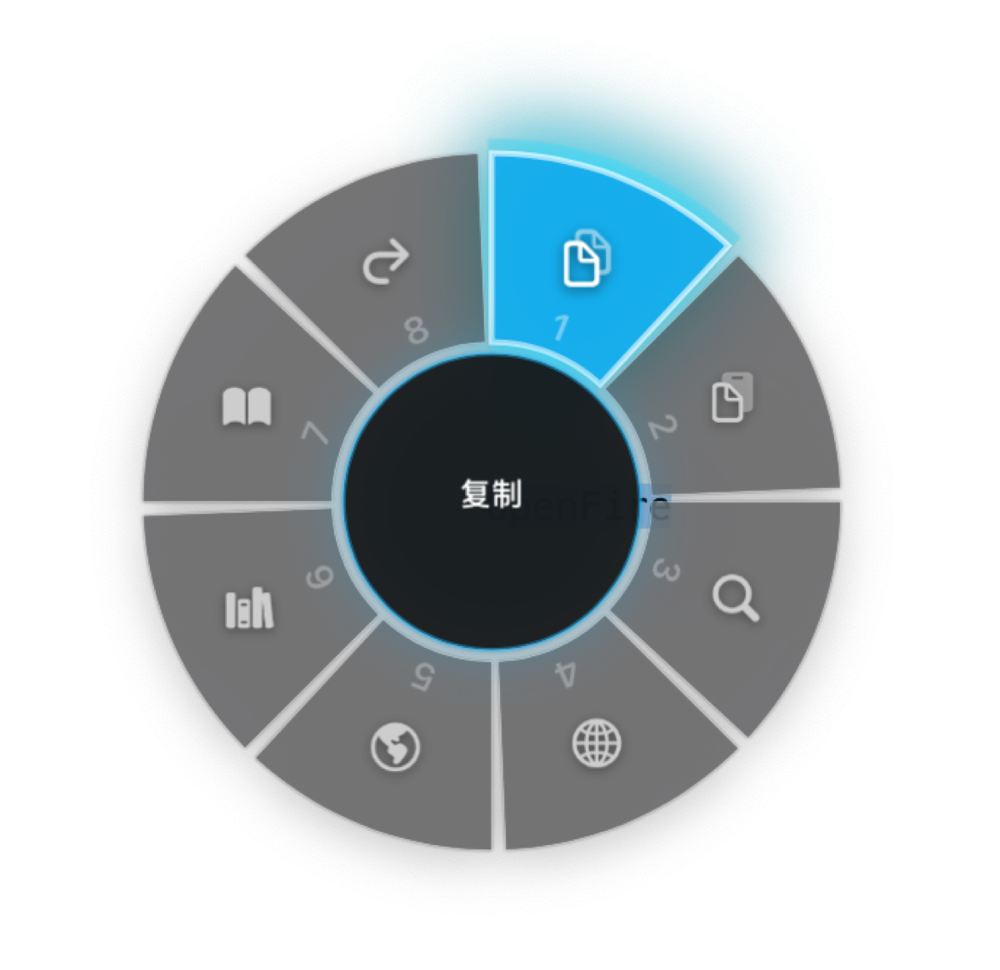

# OpenFire 🔥

[**English**](./README.md) | [简体中文](./README_zh.md)

  

An ultra-smooth, "select-to-pop" circular menu tool for macOS. Similar to PopClip, but massively refactored and extremely optimized in UI, interaction, and performance using native Core Animation and Swift Concurrency.

## ✨ Core Features

- 🎯 **Esports-level Response Speed**: Bottom-layer hit testing based on `mouseDown` / `mouseDragged` / `mouseUp`. Bid farewell to missed clicks. Once text is selected, the menu pops up instantly. Click and drag to execute functions immediately with zero-lag hover states that snap instantly to your cursor like GTA V's weapon wheel.
- 💫 **Native Blur & 60FPS Animations**: Uses `NSVisualEffectView` and `CAShapeLayer` buffer pool. Page flipping, hovering, and clicking animations are buttery smooth with no frame drops.
- 🎛️ **Highly Customizable UI**: Adjust the radial menu's **Ring Opacity** and **Max Items limit** (6, 8, 12, or 16 items per page) directly from the Menu Bar to perfectly suit your workflow.
- 🔌 **Hot-pluggable Plugin System**: Supports custom `.openfireext` plugin packages. Features double-click installation, background thread asynchronous loading, and a package management mechanism supporting deletion and disabling.
- 🛡️ **Smart Trigger Context**: Rewritten Accessibility recognition logic at the foundation. The "paste" function will only pop up within genuinely editable text boxes, eliminating invalid popups on web page background layers.
- 🚫 **Customizable App Blacklist**: Built-in automatic blacklist management UI. Supports dragging and dropping apps, or browsing via the `+` button to precisely block specific software.

## 📦 Installation

1. Download the latest `OpenFire.dmg` from [Releases](https://github.com/woodenrobot/OpenFire/releases).
2. Double-click to open, and drag the `OpenFire.app` icon into the `Applications` folder.
3. Open the app, and grant OpenFire accessibility permissions in **System Settings → Privacy & Security → Accessibility**.

## 🧩 Plugin Ecosystem

OpenFire offers powerful plugin customization capabilities. Plugins exist as `.openfireext` folders containing a `Config.json` configuration file.

### Default Pre-installed Plugins
| Plugin | Description |
|---|---|
| 📋 Copy / Cut / Paste | System clipboard management (intelligently recognizes input box context) |
| 🔍 Search / Translate / Dict | Jump to Google, invoke macOS native dictionary |
| 🔗 Open Link | Automatically identifies URLs in selected text and attempts to open them |

### Community Ecosystem Plugins (Optionally Built-in)
Built into the package, they can be enabled or removed at any time via the "Plugin Management" interface:
- **Baidu Search** / **Google Search**
- **NeoDB Book Search**
- **Douban Book Search** / **Douban Movie Search**

### Build Your Own Plugin (Supports 6 Action Types)

OpenFire comes with a fully-featured **Visual Plugin Editor** built right into the app. You no longer need to write JSON configurations manually!

1. Click the OpenFire icon in the top macOS Menu Bar.
2. Select **Plugin Management...** from the dropdown menu.
3. Click the `+` button at the bottom to open the Plugin Editor.
4. Fill in the Plugin Name, customize the Icon, and choose an Action Type.

#### Supported Action `type`:
- `url`: Open the system browser with `{text}`
- `shell-script`: Execute a Bash script, reading `$OPENFIRE_TEXT`
- `applescript`: Run osascript
- `key-combo`: Record system combo shortcuts directly from the UI
- `copy`: Copy to clipboard
- `paste`: Paste into the current input area

## 🛠 Tech Stack

- **Language / Framework**: Swift 5.9, AppKit, Objective-C Runtime assists
- **Rendering Engine**: Core Animation (`CAShapeLayer`, `CATextLayer`, `CATransaction` non-blocking animations)
- **Bottom-layer Monitoring**: CGEventTap, macOS Accessibility API (`AXUIElement`, `AXObserver`)
- **Multithreading**: GCD (`DispatchQueue.global`) and Swift Concurrency for async resource loading

## 📄 License
MIT License
